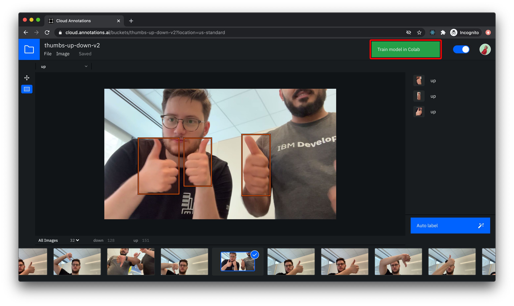
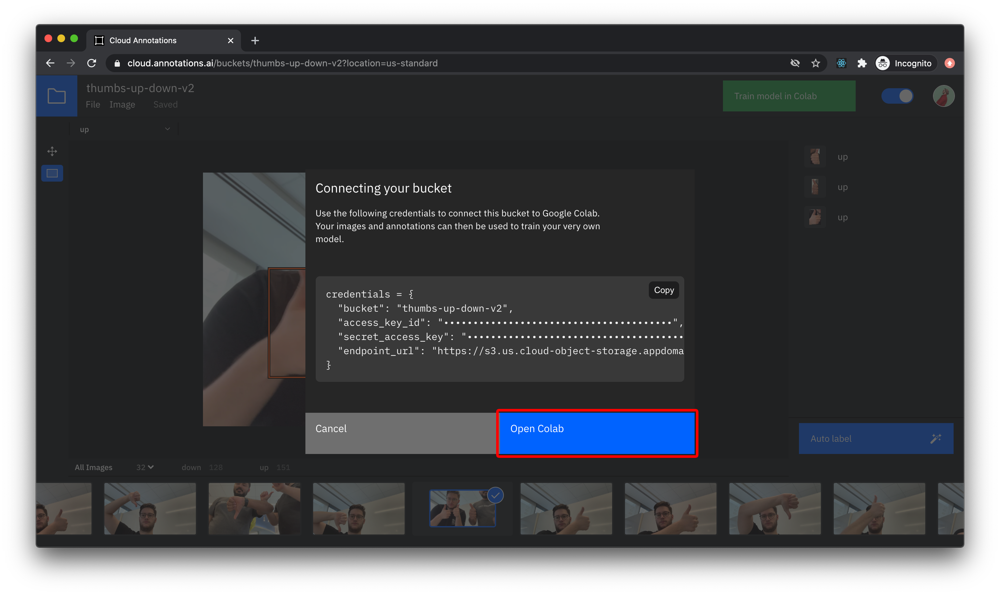
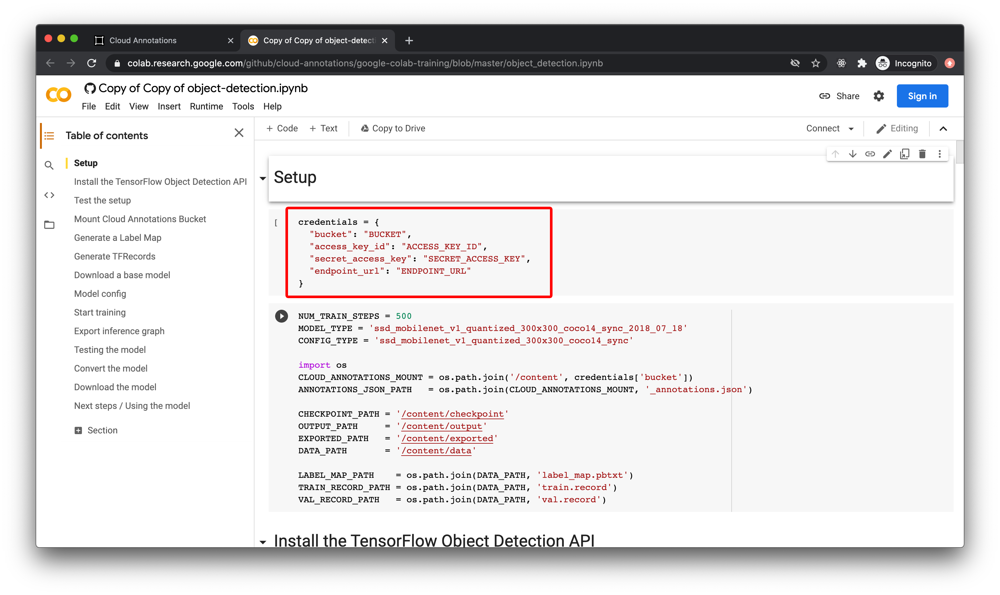

Cloud Annotations focuses on the dataset creation aspect of the model development lifecycle leaving the training up to you. There are many ways to train your model, each with their own use cases and tradeoffs. You could train from scratch using a framework like [TensorFlow](https://www.tensorflow.org/){:target="_blank"} or [PyTorch](https://pytorch.org/){:target="_blank"}, use a drag & drop tool like Apple's [Create ML](https://developer.apple.com/machine-learning/create-ml/){:target="_blank"} or use a cloud managed solution like [Watson Machine Learning](https://www.ibm.com/cloud/machine-learning){:target="_blank"}.

Today we'll be using an online tool called Google Colab as a free and easy way to get our first model trained.

## Training with Google Colab
Google Colaboratory, or “Colab” for short, is a product from Google Research. Colab allows anybody to write and execute arbitrary python code through the browser, and is especially well suited to machine learning, data analysis and education. More technically, Colab is a hosted Jupyter notebook service that requires no setup to use, while providing free access to computing resources including GPUs.

To train your model with Colab, click `Train model in Colab`.

Copy the provided credentials and click `Open Colab`.

In order to access our training data from our Colab notebook, our code needs credentials for the object storage bucket. Paste the credentials copied from the previous step into the first cell and follow the rest of the instructions provided in the notebook.

## Download the Model
The last step of the notebook will prompt you to download a zip file containing our model. Simply unzip this file to use it in any of the web demos in the next steps.

> **Note:** The model downloaded is only compatible with the web demos. To use the trained model in the other demos, additional conversions will need to be run.
